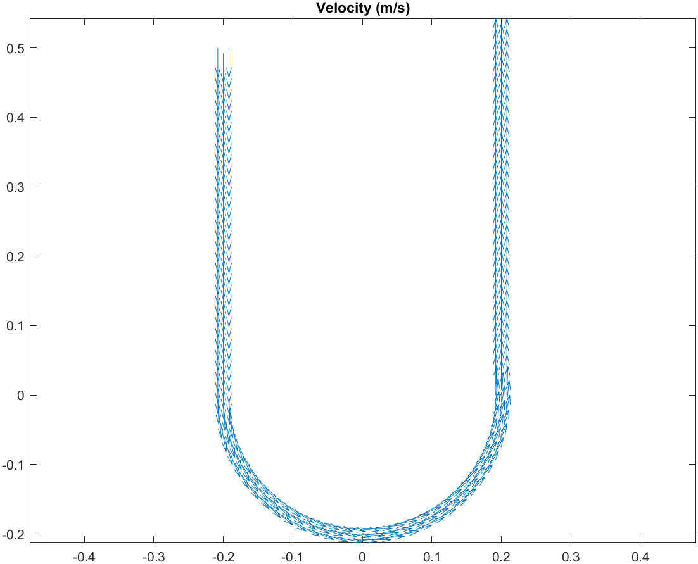

# Panel Heating Numerical Model & FEM Simulation

MATLAB-based numerical simulation of an underfloor heating system, developed as the final project for the **Numerical Modelling** course at Politecnico di Torino.

## Overview

The project models a section of an underfloor heating system consisting of a **U-shaped PEX pipe embedded in a concrete floor**. The numerical model combines fluid-flow and heat-transfer analysis to study the temperature distribution in the system and its evolution over time.

The project focuses on the numerical modelling of:

* Water flow through the embedded pipe
* Heat transfer between water, PEX and concrete
* Steady-state temperature distribution
* Transient temperature evolution during system start-up

## Numerical Model

A two-dimensional section of the floor is considered, containing:

* Water flowing through the PEX pipe
* The PEX pipe wall
* The surrounding concrete
* Thermal exchange with the floor and room environment

The computational domain is discretized using the **Finite Element Method (FEM)**.

### 1. Geometry and Mesh

The U-shaped pipe and surrounding concrete are constructed as separate computational regions. A 2D finite-element mesh is then generated for the complete domain.

The model uses a periodic boundary condition to represent the effect of neighbouring sections of the heating system.


### 2. Fluid-Flow Model

The water flow is modelled assuming **steady Stokes flow**.

The pressure field is obtained by solving the corresponding FEM problem, after which the velocity field is calculated from the pressure gradient.

The model uses prescribed inlet and outlet pressures and water viscosity as the main flow parameters.



### 3. Heat-Transfer Model

The thermal problem considers conduction through the PEX and concrete together with convection in the water domain.

Different thermal properties are assigned to each material:

| Material | Thermal Conductivity |    Density | Specific Heat |
| -------- | -------------------: | ---------: | ------------: |
| Water    |        0.621 W/(m·K) | 1000 kg/m³ | 4186 J/(kg·K) |
| PEX      |         0.35 W/(m·K) |  945 kg/m³ | 2300 J/(kg·K) |
| Concrete |         2.00 W/(m·K) | 2200 kg/m³ |  840 J/(kg·K) |

The velocity field obtained from the fluid-flow calculation is coupled to the thermal model through the convection term.


### 4. Transient Simulation

After obtaining the stationary temperature field, a transient simulation is performed to investigate the temperature evolution of the system.

The transient problem is solved using the **implicit Euler method** with:

* Time step: 5 minutes
* Simulation time: 12 hours
* Initial temperature: 10 °C
* Water inlet temperature: 40 °C

The temperature field is updated at each time step to visualize the propagation of heat through the water, pipe and concrete.


## Implementation

The MATLAB script performs the following main steps:

```text
Define geometry
      ↓
Create computational domains
      ↓
Generate FEM mesh
      ↓
Apply fluid-flow boundary conditions
      ↓
Solve pressure field
      ↓
Calculate velocity field
      ↓
Define thermal properties
      ↓
Apply thermal boundary conditions
      ↓
Solve stationary temperature field
      ↓
Build mass matrix
      ↓
Solve transient problem using implicit Euler
      ↓
Visualize results
```

## Results

The simulation produces visualizations of:

* Computational geometry
* Finite-element mesh
* Pressure distribution
* Water velocity field
* Stationary temperature distribution
* Transient temperature evolution

These results provide a numerical representation of the interaction between the fluid flow and heat transfer within the embedded heating system.

## Technologies & Methods

**Software**

* MATLAB

**Numerical Methods**

* Finite Element Method (FEM)
* Stokes-flow modelling
* Convection–diffusion heat-transfer modelling
* Stationary numerical solution
* Transient analysis
* Implicit Euler time integration

**Physical Domains**

* Fluid mechanics
* Heat transfer
* Thermal conduction
* Convection

## Course Context

**Course:** Numerical Modelling
**Institution:** Politecnico di Torino
**Project:** Final Course Project – Panel Heating for Residential Building

The FEM/numerical-modelling toolbox used in this project was provided by the course instructor. The toolbox itself is **not included in this repository**.

## Author

**Amin Zamani**
MSc Mechanical Engineering
Politecnico di Torino
